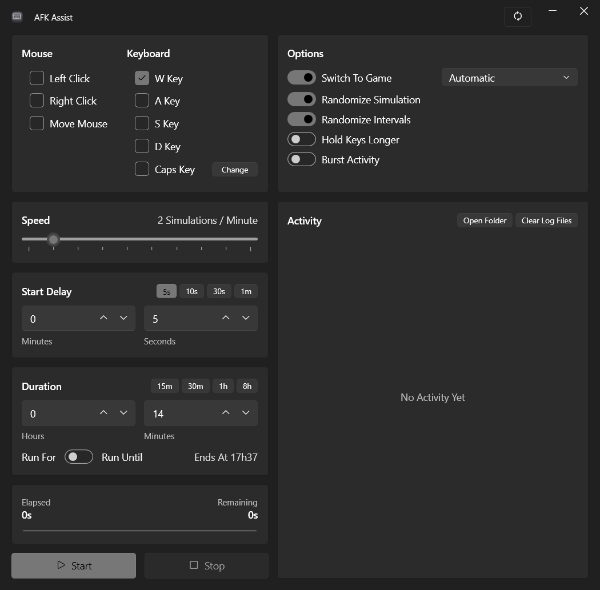
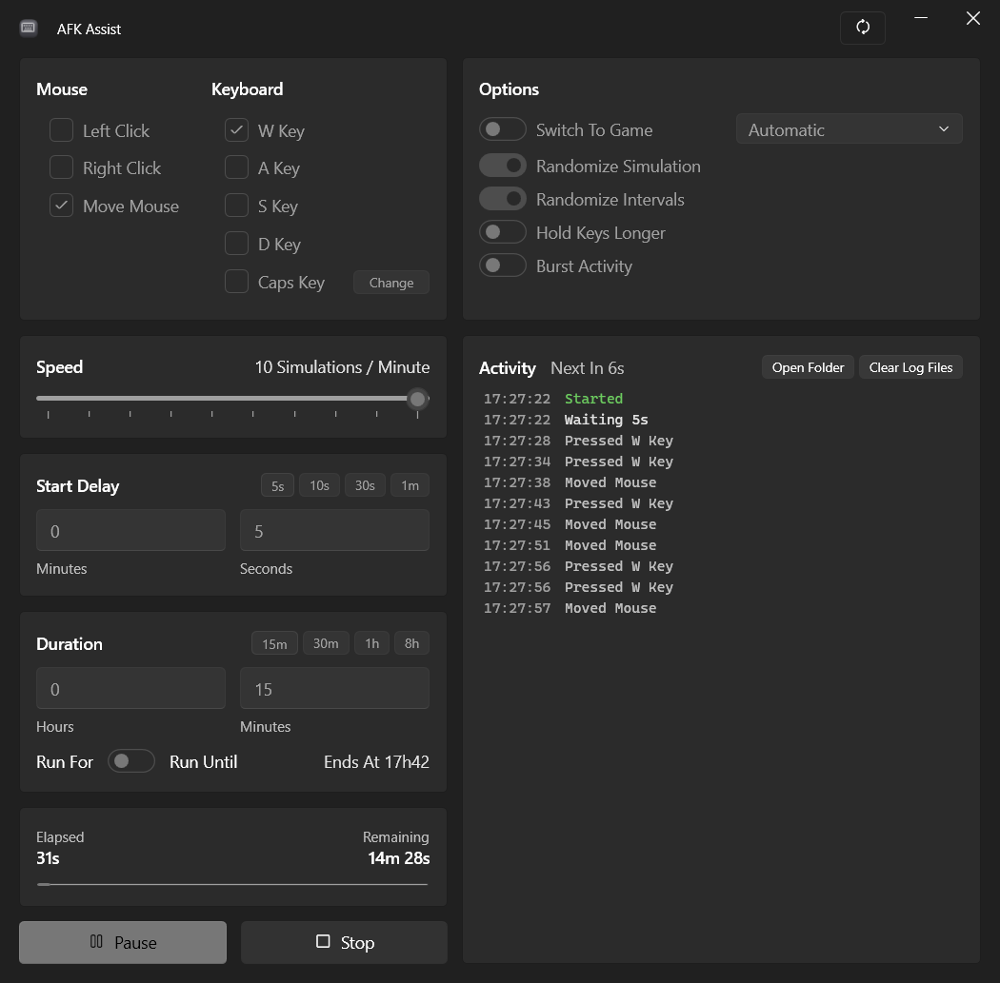

# AFK Assist

Keep Your Game Active While You Are Away By Simulating Keyboard And Mouse Input

## Features
- Keyboard (WASD Or Chosen Keys) And Mouse (Left/Right Click) Simulation
- One Custom Key, Recorded By Pressing It
- Adjustable Speed (1-10 Simulations Per Minute) With An Optional Start Delay
- Run For A Duration (Up To 8 Hours) Or Run Until A Clock Time, With Presets For Both
- Shows The Time The Run Ends In Both Modes
- Only Types Into The Game When Switch To Game Is On, And Picks The First Game It Finds
- Pauses When You Touch The PC And Resumes 5 Seconds After You Stop
- Optional: Randomized Patterns, Randomized Intervals, Longer Key Holds, Burst Activity
- Lives In The Tray While It Runs, With Pause And Stop On Its Menu
- Logs A Summary Of Everything It Sent When A Run Ends
- Timing Clusters Like Real Hands, Mouse Glides Sideways With Slight Tremor
- Works With Any Keyboard Layout, Keys Stay On The Physical WASD Positions
- Live Activity Log, Saved To Documents For 30 Days
- Every Setting And The Window Spot Are Remembered Between Sessions
- Pause To Change Anything Mid Run, Then Resume

## Quick Start
1. Choose Mouse Actions
2. Choose Keyboard Keys
3. Choose Speed
4. Choose Duration
5. Press Start

## ⚠️ Important
- Game Support For Virtual Input Varies, Some Games Only Count Mouse Activity Against Their AFK Timer
- Keep The Cursor Inside The Game Window When Clicks Are On
- Windows Flags Simulated Input As Injected, Anti-Cheat Can Tell It Apart From Real Input

## Technical Details
- Windows App Built With C# And WPF On .NET 10
- Fluent Interface Through WPF-UI, MVVM Through CommunityToolkit.Mvvm
- Input Is Injected With The Win32 SendInput API Using Both Virtual Keys And Scan Codes

## Download
Get The Latest Version From The [Latest Release](https://github.com/poolfullofmilk/AFK-Assist/releases/latest)
