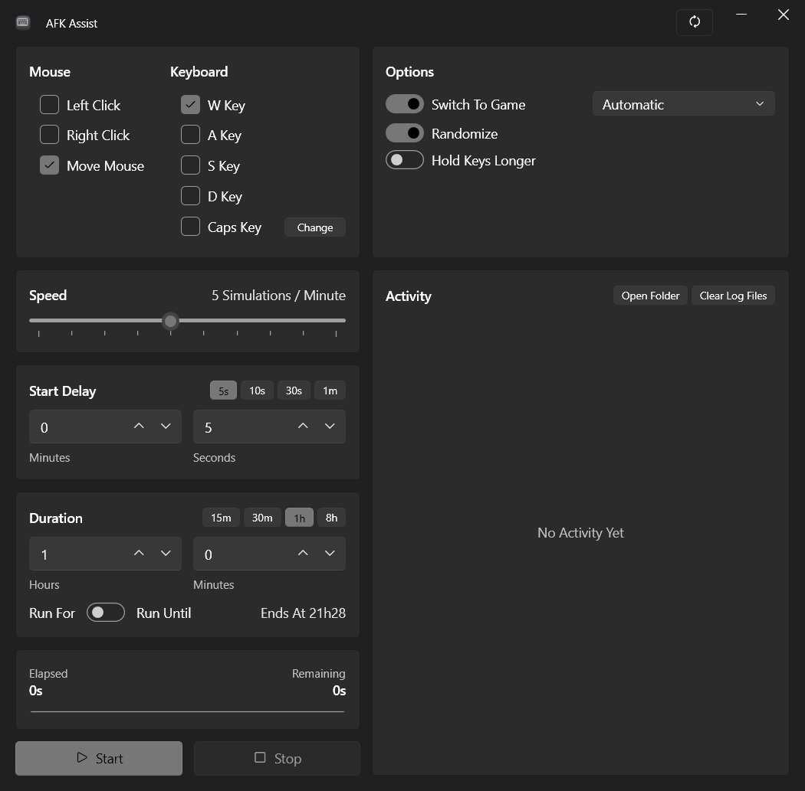
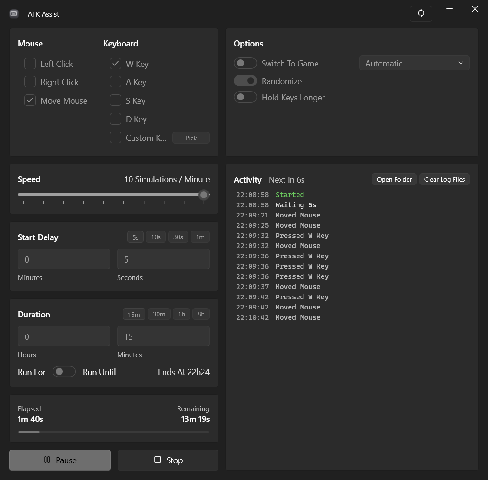

# AFK Assist

A Windows app that keeps your game from kicking you while you are away.

| Idle | Running |
|---|---|
|  |  |

## Features
- Presses keys, clicks and moves the mouse like a real player
- Can switch to your game and only type there
- Pauses the moment you touch the PC

## Quick start
1. Download the exe from the [latest release](https://github.com/poolfullofmilk/AFK-Assist/releases/latest)
2. Pick your keys and press Start

## ⚠️ Important
- Anti-cheat can tell simulated input apart from real input

## Technical details
- .NET 10, WPF and WPF-UI